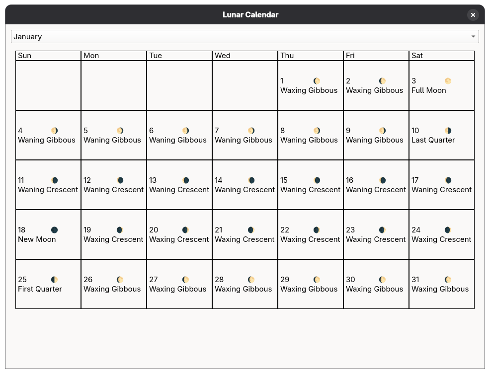

# Calendars supported

Gregorian and Ethiopian calendars are supported. Lunar phase calculation based on two seed data points for last full moon of 2024 and 2025 are used to calculate
2025 and 2026's lunar phases.

For demonstrations of APIs there is two apps: `lunar-calendar-qt` and `lunar-for-year` which support lunar phases for 2025 and 2026.
Otherwise, there's a lot of code in `tests.cpp`

# Future Features and Calendar Systems

A few ideas:

[ ] Julian calendar (I've started implementation of this), it still sees active use so it makes sense to add it
[ ] Chinese calendar (esp. around the 12 year cycle)
[ ] Mayan calendar (lots of cycles)
[ ] Time conversion between systems (e.g. Ethiopian system where the 0th hour of the day is from sunrise, it seems this is chosen as 6AM; there is also the Mars time system)
[ ] Islamic (probably the so-called Microsoft Kuwaiti algorith, but I might just use my already-existing lunar calculation for this)
[ ] More holiday calculation

# Optimization and Naivete

Many algorithms are quite naive. I was more interested in correct working code than anything resemblign fast and clever.
The main flaw as I see it as Ethiopian and Gregorian date objects really ought to be converted to simple integers for offsets from an epoch for conversion and arithmetic.
However, I wanted an "easier to verify its correctness" naive algorithm before doing that.

# AI

Some moderate AI code generation was used, however this was conservative: primarily in generation of various C++ boilerplate code for `to_string` functions and implementing comparison operators
